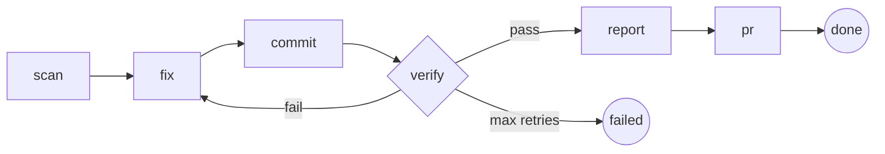

<p align="center">
  
</p>

<p align="center">
  <a href="https://github.com/nareshnavinash/dobbe-mcp/actions"></a>
  <a href="https://www.npmjs.com/package/dobbe"></a>
  <a href="https://github.com/nareshnavinash/dobbe-mcp/blob/main/LICENSE"></a>
  <a href="https://nodejs.org"></a>
  
  
</p>

---

```
$ /dobbe-vuln-resolve

[scan]    Found 3 Dependabot alerts (2 critical, 1 high)
[fix]     Upgraded lodash 4.17.20 -> 4.17.21, axios 0.21.1 -> 0.21.4
[verify]  Running tests... FAILED (TypeError in utils.js:42)
[retry]   Attempt 2/3 -- feedback injected, retrying with error context
[fix]     Pinned axios 0.21.4, added @types/lodash
[verify]  Running tests... PASSED (147/147)
[pr]      Created PR #142: "fix: resolve vulnerable dependencies"
```

## Why dobbe?

- **Your AI skips steps. dobbe can't.** Every pipeline is a finite state machine with Zod validation at each transition. Claude submits results, the server validates them, and only then advances to the next step. If tests fail, the server loops back automatically with the exact error output injected as context. This is program control flow, not prompt engineering.

- **45 minutes to 3 minutes.** A typical Dependabot triage: open GitHub, read 12 alerts, figure out which matter, checkout a branch, upgrade packages, run tests, debug failures, run tests again, push, create a PR. With dobbe: type `/dobbe-vuln-resolve`. The pipeline handles all steps including up to 3 retry loops if tests break.

- **One command. No config files.** `npx dobbe install` registers the MCP server and 24 slash commands. No YAML. No dashboard. No SaaS signup. Uninstall with `npx dobbe uninstall`.

### Before vs. After

| Task | Without dobbe | With dobbe |
|---|---|---|
| Resolve Dependabot alerts | Open GitHub, read alerts, checkout, upgrade, test, fix, test again, PR (~45 min) | `/dobbe-vuln-resolve` -- auto-retry, PR created (~3 min) |
| Code review all open PRs | Read each diff, write comments, check security/tests/quality | `/dobbe-review-post` -- deep review + comments posted |
| Find coverage gaps + write tests | Run coverage, find gaps, write tests, run, fix, repeat | `/dobbe-test-gen` -- analyze, generate, verify, retry, PR |
| DORA metrics | Query GitHub API, compute 4 metrics, format report | `/dobbe-metrics-dora` -- one command |
| Triage Sentry incidents | Open Sentry, read stack traces, search codebase, write analysis | `/dobbe-incident-triage` -- fetch, analyze, report |

## Quick Start

```bash
npx dobbe install
```

Restart Claude Code, then try:

```
/dobbe-vuln-scan
/dobbe-review-digest
/dobbe-metrics-dora
```

```bash
# Uninstall
npx dobbe uninstall
```

## How It Works

The MCP server runs a finite state machine. Each step declares **what** needs to happen (intent, mode, context) and Claude decides **how** to accomplish it. Results are validated with Zod schemas before advancing.



> **The server controls the workflow, not the prompt.** Each step has a declarative `intent` (what to do), `mode` (plan, act, gather, or report), and `context` (structured parameters). Claude uses its best tools and UX for the job. If results fail Zod validation, the server rejects them. If tests fail at the verify step, the server loops back to `fix` with the error output injected as feedback -- up to 3 iterations.

## Commands

### AI-Powered Pipelines

| Command | What it does | Pipeline flow | Retry |
|---|---|---|---|
| `/dobbe-vuln-scan` | Scan + triage Dependabot alerts | scan -> report -> done | -- |
| `/dobbe-vuln-resolve` | Scan, fix, test, retry, create PR | scan -> fix -> commit -> verify -> report -> pr -> done | 3x |
| `/dobbe-review-digest` | Fetch PRs, deep review, generate digest | fetch -> review -> done | -- |
| `/dobbe-review-post` | Review PRs, post comments to GitHub | fetch -> review -> post -> done | -- |
| `/dobbe-audit-report` | Security audit (vulns, licenses, secrets, quality) | analyze -> done | -- |
| `/dobbe-deps-analyze` | Dependency health, licensing, usage analysis | analyze -> done | -- |
| `/dobbe-test-gen` | Find coverage gaps, generate tests, verify, PR | analyze -> generate -> verify -> commit -> pr -> done | 3x |
| `/dobbe-changelog-gen` | Git history to categorized release notes | analyze -> done | -- |
| `/dobbe-migration-plan` | Plan + execute dependency migrations | plan -> apply -> verify -> commit -> pr -> done | 3x |
| `/dobbe-incident-triage` | Sentry issue triage with AI root cause analysis | fetch -> triage -> done | -- |

### Multi-Perspective Reviews

| Command | What it does |
|---|---|
| `/dobbe-review-as-pm` | Product Manager review -- feature gaps, prioritization, roadmap |
| `/dobbe-review-as-engineer` | Engineering review -- architecture, code quality, tech debt |
| `/dobbe-review-as-designer` | Design review -- UX, accessibility, interaction patterns |
| `/dobbe-review-as-qa` | QA review -- test coverage, edge cases, reliability |
| `/dobbe-review-as-test-architect` | Test architecture review -- strategy, frameworks, coverage |
| `/dobbe-review-as-marketing` | Marketing review -- positioning, messaging, go-to-market |
| `/dobbe-review-as-sales` | Sales review -- competitive positioning, pricing, objections |
| `/dobbe-project-review` | Run all 7 perspectives + synthesized summary |

Each review pipeline uses `gather` mode to understand the project interactively, then `plan` mode for deep analysis.

### Metrics & Scanning

| Command | What it does |
|---|---|
| `/dobbe-metrics-dora` | DORA metrics (deploy frequency, lead time, failure rate, MTTR) |
| `/dobbe-metrics-velocity` | PR velocity and cycle time metrics |
| `/dobbe-scan-secrets` | Secrets and credentials scanner |

### Utilities

| Command | What it does |
|---|---|
| `/dobbe-setup` | Interactive configuration wizard |
| `/dobbe-doctor` | Environment health check |
| `/dobbe-config` | View and manage configuration |

## Works With

| Integration | Used by |
|---|---|
| **GitHub** (Dependabot, PRs, Actions) | vuln-scan, vuln-resolve, review-*, metrics-*, changelog-gen |
| **Sentry** | incident-triage |
| **Slack** | Notification delivery (configurable channel) |
| **npm / pip / bundler / Cargo / Go mod** | vuln-resolve, deps-analyze, migration-plan |
| **Jest / pytest / Vitest / Go test / RSpec** | test-gen (auto-detects framework) |

Auto-detects your framework: Django, Angular, React, Next.js, Express, Flask, FastAPI, Spring Boot, Rails.

## Prerequisites

- **Claude Code** -- installed and authenticated
- **Node.js 18+** -- for the MCP server
- **gh CLI** -- for GitHub API access (`brew install gh`)
- **MCP servers** (optional) -- GitHub, Sentry, Slack for enhanced capabilities

## Architecture

**Why a state machine?** LLMs are stateless -- they forget context between tool calls. A state machine ensures every step executes in order, results are validated with Zod schemas before advancing, and retry loops inject the exact error output from the previous attempt. This is control flow, not prompt engineering.

```
Claude Code (executor)
    |
    v
dobbe MCP Server (state machine controller)
    |
    +-- 21 Pipeline definitions
    |   +-- Each pipeline: states, transitions, Zod schemas, intent/mode/context/hints
    |   +-- 3 pipelines with retry loops (vuln-resolve, test-gen, migration-plan)
    |   +-- 7 role-based review pipelines + 1 aggregate project-review
    |
    +-- State machine engine (generic FSM)
    |   +-- Zod validation per step
    |   +-- Retry logic with feedback injection
    |   +-- Persistent sessions (crash recovery)
    |
    +-- 14 MCP Tools
    |   +-- pipeline_start, pipeline_step, pipeline_complete, pipeline_status
    |   +-- pipeline_list, pipeline_list_sessions, pipeline_abort
    |   +-- config_read, config_write
    |   +-- cache_get, cache_set
    |   +-- session_load, session_save
    |
    +-- Utilities
        +-- Atomic file writes (crash-safe)
        +-- Structured logging (JSON + pretty mode)
        +-- Framework detection (Django, React, Angular, Express, etc.)
        +-- File-based cache with TTL
```

## Built to Ship

- **373 tests** with **94% coverage** -- every pipeline path is tested
- **21 pipelines** with **Zod validation** at every state transition
- **3 retry pipelines** with automatic feedback injection
- **Zero global mutable state** -- `PipelineService` is fully isolated and testable
- **Atomic file writes** -- crash-safe session persistence via write-to-temp + rename
- **CI on Node 18, 20, 22** -- tested across all active LTS versions

<details>
<summary><strong>Configuration</strong></summary>

Config is stored in `~/.dobbe/config.toml`. Run `/dobbe-setup` in Claude Code to configure.

```toml
[general]
default_org = "acme"
default_format = "table"
default_severity = "critical,high,medium,low"

[notifications]
slack_channel = "#security-alerts"

[timeouts]
scan = 300
resolve = 600
review = 300
```

**Environment variables:**

| Variable | Description | Default |
|---|---|---|
| `DOBBE_HOME` | Override ~/.dobbe directory | `~/.dobbe` |
| `DOBBE_LOG_LEVEL` | `debug` / `info` / `warn` / `error` | `info` |
| `DOBBE_LOG_FORMAT` | `json` / `pretty` | `json` |

</details>

## Development

```bash
git clone https://github.com/nareshnavinash/dobbe-mcp.git
cd dobbe-mcp
npm install
npm test              # 373 tests
npm run test:coverage # 94%+ coverage
npm run build
npm run lint
```

See [CONTRIBUTING.md](CONTRIBUTING.md) for development guidelines.

## License

MIT
